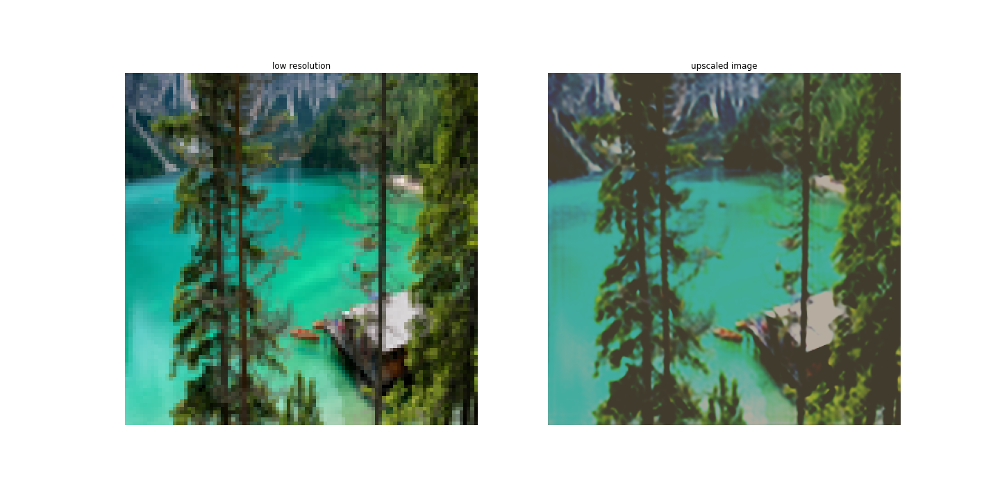

# Super Resolution Model and Web App

This repository contains a super resolution network upscaling images of a factor of 4 and a web app. The final web app looks like th
is:


## Data
* data from [kaggle.com](https://www.kaggle.com/datasets/akhileshdkapse/super-image-resolution)
* raw data saved in data/HR (high resolution) and data/LR (low resolution)
* 100 images
* data exploration: notebooks/data-exploration.ipynb 

## Preprocessing
* preprocessing.py
    * splits the data in validation and training
    * saves splits in h5 files to data/train.h5 and data/valid.h5

## Model
* train 2 models:
    * SRResNet
    * SRGAN (ToDo)
* based on: Photo-Realistic Single Image Super-Resolution Using a Generative Adversarial Network, Ledig et al. (2017), https://doi.org/10.48550/arXiv.1609.04802
* model code based on https://github.com/sgrvinod/a-PyTorch-Tutorial-to-Super-Resolution
* converted to pytorch lightning
* added NNI for hyperparamtertuning
* added mlflow

## Training 
### SRResNet
* run script with desired parameters, e.g. ```python3 srresnet.py --n-blocks 8 --batch-size 12 --n-channels 22 --gpus 1 --n-epochs 200```
* use batch script saved in ```jobs/start_job.sh``` or ```start_job_nni.sh``` to include hyperparameter tuning using ```nni```
* results are not reported to nni, but to mlflow
* example files for hyperparamter tuning are in ```nni/config/config.py``` and ```nni/search_space/search_space.json```

## Evaluation 
* example plots are in notebooks/plot-predictions.ipynb


## Deployment
* model is served using torchserve
* the handler script is based on the ```BaseHandler``` class and can be found in ```deployment/srnet_handler.py```
* create the ```.mar``` file using the ```create-mar.sh``` script
* run ```docker build -t srnet-mar:v1 .``` to create the docker image
* ```docker run -p 8080:8080 -p 8081:8081 srnet-mar:v1```
* check registeres models: ```curl http://127.0.0.1:8081/models```
* make predictions: ```curl http://127.0.0.1:8080/predictions/srnet -T ../data/LR/0.png``` 
* The config.properties file is needed to change the maximun output size

## Web App
* simple web app is stored in folder ```app```
* run ```docker-compose up``` to start the services
* navigate to ```localhost:9696``` in browser

